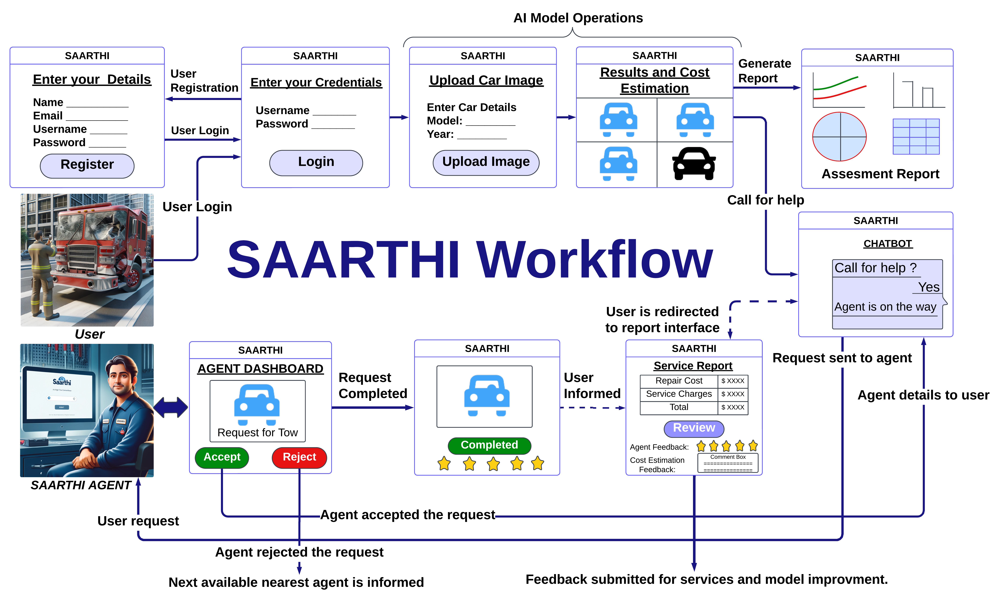

# Cardd - Car Damage Detection and Assessment System

Car Damage Detection and Assessment (Cardd) is a machine learning-powered web application designed to detect and assess damages in cars. The project uses a U-Net-based deep learning model for segmentation and classification of car damages, providing detailed visualizations and cost estimates.

---
## Saarthi Framework and Website

- **Saarthi Website**: Visit the live project at [Saarthi](https://sites.google.com/view/saarthi-home/home)
- **Framework Overview**:  
  { width=600px }


---

## Features

- **Damage Detection and Segmentation**: Identify and segment areas of damage on cars using U-Net models.
- **Cost Estimation**: Provide an approximate repair cost based on the type and severity of damage.
- **User Authentication**: Role-based authentication for Admins, Agents, and Users.
- **Dashboard**: Interactive dashboards for users and agents to manage and view results.
- **Live Video Detection**: Detect damages in real-time via a live video stream.
- **Upload and Results Management**: Upload images for damage detection and manage results efficiently.

---

## Directory Structure

```plaintext
chirayu-sanghvi-Cardd/
├── README.md                      # Project documentation
├── app.py                         # Main application entry point
├── app_initial.py                 # Initial app configurations (for testing)
├── dummpyapp.py                   # Experimental app logic
├── dummyconfigcardamage.py        # Dummy configuration for testing
├── dummymodeltest.py              # Model testing script
├── generate_hash.py               # Utility to generate hash for security
├── modelsalienttest.py            # Salient object detection tests
├── modeltest.py                   # Model testing script
├── unet_model.pth                 # Trained U-Net model
├── unet_model_8_final.pth         # Final U-Net model
├── instance/                      # Instance-specific data
│   └── site.db                    # SQLite database
├── migrations/                    # Database migration files
│   ├── alembic.ini
│   └── versions/
│       └── Migration files
├── mmdetection/                   # MMDetection configurations (if used)
├── static/                        # Static files (CSS, images, results)
│   ├── css/
│   │   └── style.css              # Application styles
│   ├── gifs/                      # Placeholder for gifs
│   ├── image/
│   │   └── authentication.webp    # Authentication image
│   ├── results/
│   │   ├── cost/                  # Cost-related result data
│   │   ├── mask/                  # Mask-related visualizations
│   │   └── vis/                   # Visualizations
│   └── uploads/                   # User uploads
└── templates/                     # HTML templates for Flask
    ├── add_agent.html             # Add agent interface
    ├── admin_dashboard.html       # Admin dashboard
    ├── admin_login.html           # Admin login
    ├── agent_dashboard.html       # Agent dashboard
    ├── agent_login.html           # Agent login
    ├── home.html                  # Landing page
    ├── index.html                 # Index page
    ├── live_video.html            # Live video page
    ├── login.html                 # Login page
    ├── object_detection.html      # Object detection interface
    ├── register.html              # User registration
    ├── results.html               # Results display
    ├── salient_detection.html     # Salient object detection
    ├── salient_results.html       # Salient results display
    └── user_dashboard.html        # User dashboard
```
---
## Installation
Prerequisites
- **Python 3.8 or higher**
- **Flask**
- **PyTorch**
- **SQLite**
- **OpenCV**
- **MMDetection**
- **MMCV**
---
## Steps
1) Clone the Repository:
```plaintext
git clone https://github.com/chirayu-sanghvi/Cardd.git
cd chirayu-sanghvi-Cardd
```

2) Install Dependencies
```plaintext
pip install -r requirements.txt
Set Up Database:
```
3) Setup Database
```
flask db init
flask db migrate
flask db upgrade
```

4) Run the Application
```
python app.py
```
5) Access the Application
- **Open your browser and go to http://127.0.0.1:5000**
---
## Usage

1. **Upload an Image**: Navigate to the home page and upload a car image.
2. **View Results**: Check the segmented damage area and estimated repair cost.
3. **Dashboard Access**:
   - **Admin**:
     - Manage agents.
     - View all results.
   - **Agent/User**:
     - View personal data.
     - Manage personal results.
---

## Models

- **U-Net**:
  - `unet_model.pth`: Initial trained model for salient object detection.
  - `unet_model_8_final.pth`: Final trained model for salient object detection, focusing on segmenting key damage areas.

- **Mask R-CNN**:
  - Located in the `mmdetection/` folder.
  - Used for damage detection and instance segmentation.
  - Provides precise bounding boxes and segmentation masks for individual damage instances.

- **Salient Object Detection**:
  - Prototype models for experimental detection are also available for further testing and evaluation.

---

## Contributing

We welcome contributions! Please fork the repository, make your changes, and submit a pull request. Ensure all tests pass before submitting.

---

## License

This project is licensed under the MIT License. See the [LICENSE](./LICENSE) file for details.

---

## Contact

For queries, reach out to **Chirayu Sanghvi** at [chirayus@buffalo.edu](mailto:chirayus@buffalo.edu).

---

## Acknowledgments

- **U-Net Architecture**: [Paper](https://arxiv.org/abs/1505.04597)
- **MMDetection Framework**: [MMDetection Documentation](https://github.com/open-mmlab/mmdetection)
- **Flask Framework**: [Flask Documentation](https://flask.palletsprojects.com/)
